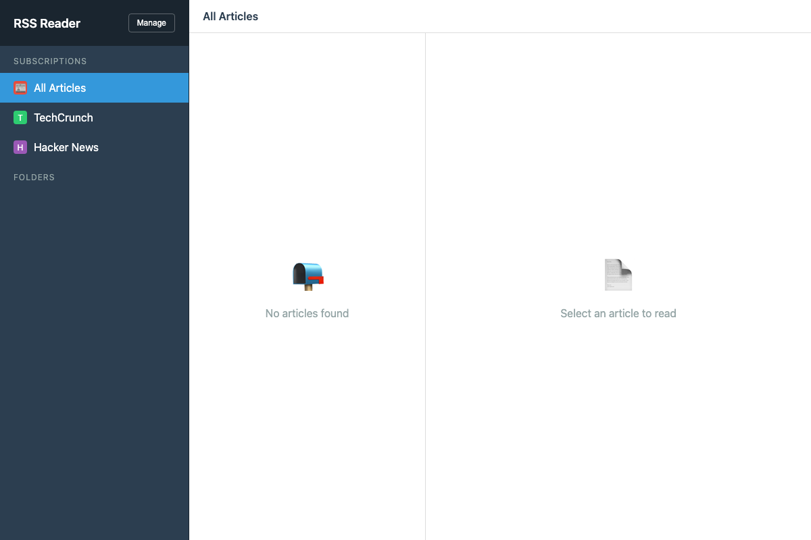
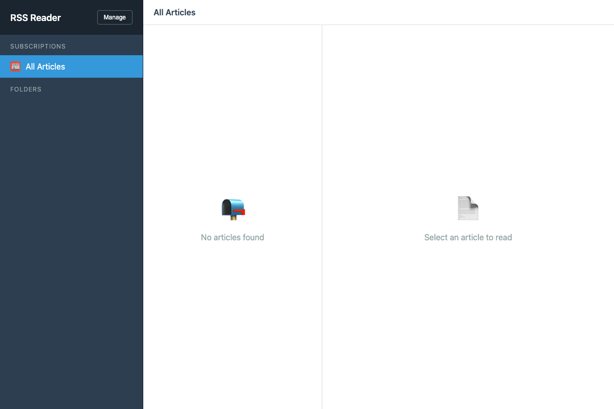
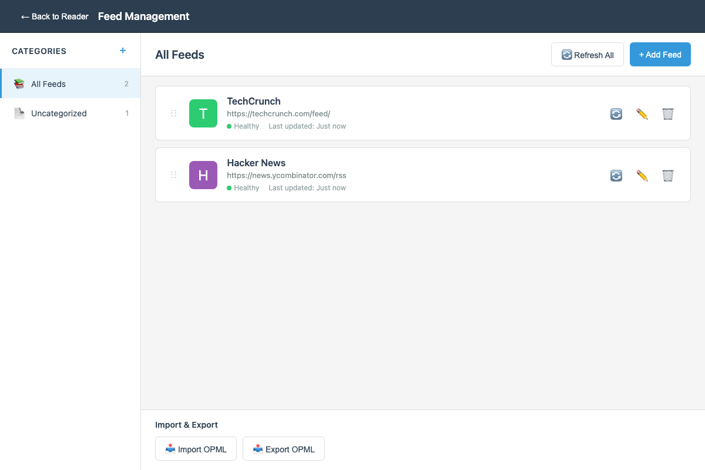

# rss-util

An RSS reader designed for maximum utility.

## Description

A simple desktop RSS reader application for Mac built with Electron. The application features a clean three-panel layout:
- **Left sidebar**: Feed subscriptions and folders
- **Middle panel**: Article list
- **Right panel**: Article preview/content



## Features

- Clean, intuitive three-panel interface
- Organize feeds into custom categories/folders
- Track read/unread status of articles
- Automatic feed refresh on startup
- Feed health monitoring
- **Keyboard shortcuts** - Navigate efficiently with vim-like keyboard controls
- **Image toggle** - Show or hide images in article previews
- **Toast notifications** - Visual feedback for app actions
- **Settings** - Configure OpenAI API key and manage feature flags
- **Automatic updates** - The app checks for updates automatically and notifies you when new versions are available
- **Data migration** - Your data is automatically migrated when updating to new versions
- OPML import/export support (coming soon)

## Prerequisites

- Node.js (v18 or higher recommended)
- npm (comes with Node.js)

## Installation

### Step 1: Clone the Repository

```bash
git clone https://github.com/busse/rss-util.git
cd rss-util
```

### Step 2: Install Dependencies

```bash
npm install
```

This will install all required dependencies including Electron and the RSS parser.

### Step 3: Run the Application

```bash
npm start
```

The application will launch in a new window. On first launch, you'll see an empty state with no feeds subscribed.



## Usage

### Adding Feeds

1. Click the **"Manage"** button in the top-left corner of the sidebar
2. Click the **"+ Add Feed"** button
3. Enter the RSS feed URL (e.g., `https://example.com/feed.xml`)
4. Optionally provide a custom name for the feed (otherwise it will use the feed's title)
5. Select a category/folder if you want to organize it
6. Click **"Add Feed"**

The feed will be fetched automatically and articles will appear in your reader.

### Organizing Feeds into Categories

1. Go to the Feed Management page (click "Manage" in the sidebar)
2. Click the **"+"** button next to "Categories" in the left sidebar
3. Enter a category name and choose an icon
4. Click **"Add Category"**
5. When adding or editing feeds, select the category from the dropdown

Feeds can be organized into multiple categories to help you stay organized.

### Reading Articles

1. Click on a feed in the left sidebar to view its articles
2. Click on an article in the middle panel to read it in the preview pane
3. Articles are automatically marked as read when you click on them
4. Unread articles are shown in bold with an unread count badge

### Navigation

- **Left Sidebar**: Browse feeds and categories
- **Middle Panel**: View article list for the selected feed/category
- **Right Panel**: Read article content
- **"All Articles"**: View all articles from all feeds in chronological order



### Keyboard Shortcuts

The app includes powerful keyboard shortcuts for efficient navigation:

- **J** - Navigate to next article
- **K** - Navigate to previous article
- **V** - Open selected article in your default browser
- **R** - Refresh all feeds
- **[** - Collapse sidebar for more reading space
- **]** - Expand sidebar
- **Escape** - Close modals (Help, About, etc.)

These shortcuts work when you're not typing in an input field, allowing for quick navigation without using the mouse.

### Image Toggle

Use the image toggle button in the toolbar to show or hide images in article previews. This is useful for:
- Faster loading when on slower connections
- Cleaner reading experience
- Reducing bandwidth usage

The toggle state is indicated by the button appearance, and a toast notification confirms the action.

### Toast Notifications

The app provides visual feedback through toast notifications for various actions:
- Image toggle on/off
- Feed refresh status
- Other user actions

Notifications appear briefly at the bottom of the screen and automatically dismiss.

### Settings

Access the Settings area by clicking the **Settings** button (⚙️) in the sidebar footer. The Settings modal allows you to configure:

#### OpenAI API Key

- **Secure Storage**: Your OpenAI API key is encrypted using AES-256-GCM encryption before being stored locally
- **Show/Hide Toggle**: Click the eye icon to reveal or hide your API key while entering it
- **Usage**: The API key will be used for AI-powered features (when implemented)

To configure your API key:
1. Click the Settings button in the sidebar footer
2. Enter your OpenAI API key in the "API Key" field
3. Click "Save" to store it securely

#### Feature Flags

The Settings area includes a feature flag system that allows you to enable or disable specific features:

- **AI Article Summary**: Enable AI-powered article summaries (coming soon)

Feature flags can be toggled on or off using the toggle switches in the Settings modal. Changes are saved immediately when you click "Save".

### Feed Management

The Feed Management page allows you to:
- Add, edit, and delete feeds
- Create and organize categories
- Refresh individual feeds or all feeds at once
- Monitor feed health status
- Import/export OPML files (coming soon)

## Auto-Updates

The application includes automatic update functionality powered by `electron-updater` and GitHub Releases.

### How It Works

- **Automatic Checking**: The app automatically checks for updates on startup (after a 5-second delay) and then every 4 hours
- **Update Notifications**: When an update is available, a notification banner appears at the top of the application
- **Download Progress**: During download, you'll see a progress bar showing the download status
- **Installation**: Once downloaded, click the "Install & Restart" button to install the update and restart the app
- **Data Safety**: Your feeds, articles, and settings are automatically preserved during updates

### Update Behavior

- Updates are checked automatically in the background
- You can dismiss the update notification if you want to update later
- The app will continue to work normally even if you don't update immediately
- Updates are downloaded in the background and don't interrupt your reading

### Data Migration

When updating to a new version, the app automatically runs data migrations to ensure your data structure is compatible with the new version. Migrations are:
- **Automatic**: Run on app startup before the main window opens
- **Safe**: Your data is preserved and transformed as needed
- **Idempotent**: Safe to run multiple times without issues

## Building and Releasing

### Building the Application

To build the application for distribution:

```bash
# Build for macOS (creates DMG)
npm run build:mac

# Build for all platforms
npm run build
```

The built application will be in the `dist/` directory.

### Version Management

The project uses semantic versioning (SEMVER). To bump the version:

```bash
# Patch version (1.0.0 → 1.0.1)
npm run version:patch

# Minor version (1.0.0 → 1.1.0)
npm run version:minor

# Major version (1.0.0 → 2.0.0)
npm run version:major
```

### Creating a Release

1. **Bump the version**:
   ```bash
   npm run version:patch  # or minor/major
   ```

2. **Build the application**:
   ```bash
   npm run build:mac
   ```

3. **Create a GitHub Release**:
   - Go to the [GitHub Releases page](https://github.com/busse/rss-util/releases)
   - Click "Draft a new release"
   - Create a tag matching the version (e.g., `v1.0.1`)
   - Upload the DMG file from the `dist/` directory
   - Publish the release

4. **Auto-Update**: Once the release is published, users with the app installed will automatically be notified of the update on their next check (or within 4 hours).

## Development

This project uses Electron to create a cross-platform desktop application. The main files are:

- `main.js` - Electron main process (includes auto-updater and migration runner)
- `index.html` - Main reader interface
- `manage.html` - Feed management interface
- `preload.js` - Secure IPC bridge between main and renderer processes
- `migrations/` - Data migration scripts for version upgrades

### Generating Screenshots

To regenerate screenshots for the README:

```bash
npm run screenshots
```

This will create screenshots in the `screenshots/` directory using Playwright.

### Creating Migrations

When making breaking changes to data structures, create a migration file in the `migrations/` directory:

1. Create a file named `migration-X.Y.Z-to-A.B.C.js` (where X.Y.Z is the from version and A.B.C is the to version)
2. Export an object with:
   - `fromVersion`: The version this migration starts from
   - `toVersion`: The version this migration upgrades to
   - `migrate(dataDir)`: An async function that performs the migration

Example migration structure:
```javascript
module.exports = {
  fromVersion: '1.0.0',
  toVersion: '1.1.0',
  async migrate(dataDir) {
    // Migration logic here
    // Read existing data, transform, write back
  }
};
```

Migrations should be **idempotent** (safe to run multiple times) and should preserve user data.

## Contributing

We welcome contributions! If you have ideas for new features, improvements, or bug fixes, please:

1. **Request Features**: Open an issue on GitHub using the [Issues tab](https://github.com/yourusername/rss-util/issues) and describe the feature you'd like to see
2. **Report Bugs**: If you encounter any issues, please report them via the Issues tab
3. **Submit Pull Requests**: If you'd like to contribute code, fork the repository, make your changes, and submit a pull request

Your feedback and contributions help make rss-util better for everyone!

## License

This project is licensed under the MIT License - see the [LICENSE](LICENSE) file for details.
